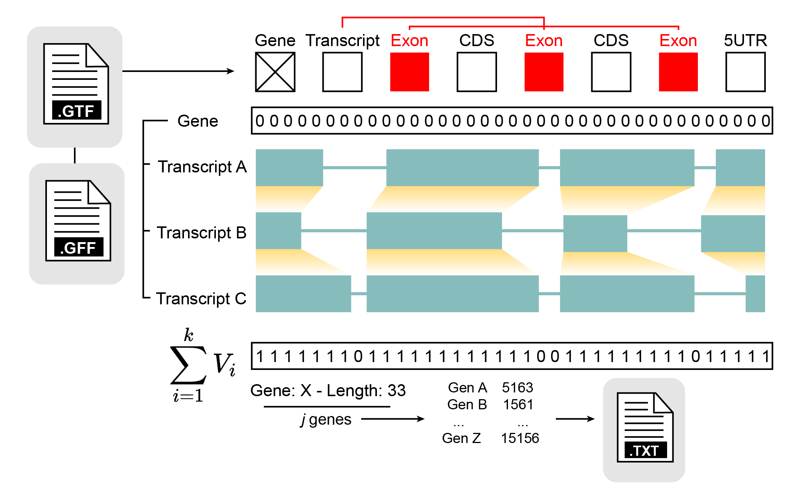
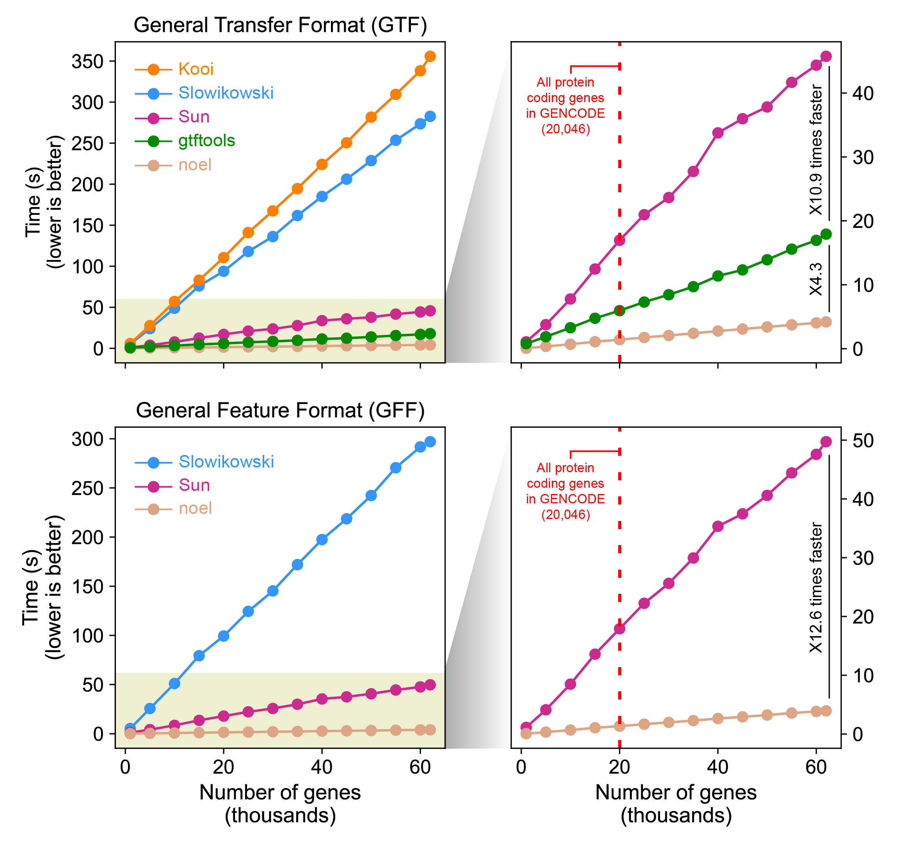
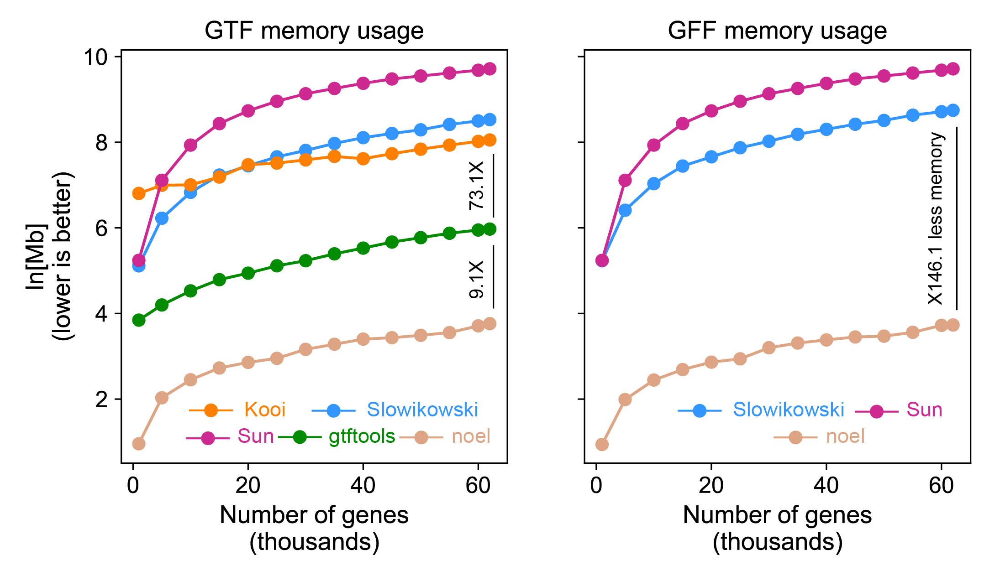

# noel

An extremely fast GTF/GFF per gene Non-Overlapping Exon Length calculator (noel) written in Rust.

<p align="center">
    
</p>

Takes in a GTF/GFF file and outputs a .txt file with non-overlapping exon lengths. 

## Usage
``` rust
Usage: noel[EXE] --i <GTF/GFF> --o <OUTPUT>

Arguments:
    --i <GTF/GFF>: GTF/GFF file
    --o <OUTPUT>: .txt file

Options:
    --help: print help
    --version: print version
```

#### crate: [https://crates.io/crates/noel](https://crates.io/crates/noel)


## Installation
to install noel on your system follow this steps:
1. download rust: `curl https://sh.rustup.rs -sSf | sh` on unix, or go [here](https://www.rust-lang.org/tools/install) for other options
2. run `cargo install noel` (make sure `~/.cargo/bin` is in your `$PATH` before running it)
4. use `noel` with the required arguments

## Build
to build noel from this repo, do:

1. get rust (as described above)
2. run `git clone https://github.com/alejandrogzi/noel.git && cd noel`
3. run `cargo run --release <GTF/GFF> <OUTPUT>` (arguments are positional, so you do not need to specify --i/--o)

## Library
to include noel as a library and use it within your project follow these steps:
1. include `noel = 0.1.0` or `noel = "*"` under `[dependencies]` in your `Cargo.toml` file or just run `cargo add noel` from the command line
2. the library name is `noel`, to use it just write:

    ``` rust
    use noel::{noel, noel_reader}; 
    ```
    or 
    ``` rust
    use noel::*;
    ```
3. invoke
    ``` rust
    let exons = noel_reader(input: &PathBuf)
    let lengths: HashMap<String, u32> = noel(exons: HashMap<String, Vec<(u32, u32)>>)
    ```


## Benchmark

There are a handful amount of open-sourced tools/software/scripts to calculate non-overlapping exon lengths, namely: Kooi [1], Sun [2], and Slowikowski [3, 4] scripts, and gtftools (-l flag) [5]. The Non-Overlapping Exon Length calculator (NOEL; referred just as "noel"), is introduced as a novel tool that outperforms the aforementioned software due to its remarkable performance. 

To assess the efficiency of noel and test the capabilities of other available scripts/tools, I used run times and memory usage estimates, based on 5 consecutive runs. This evaluation focused on two major gene annotation formats: GTF and GFF. It is worth nothing, however, that only 3 tools are capable of handling GFF files: Slowikowski, Sun* (described below) and noel. Before any batch of runs, I first modified each script to be CLI-responsive. Additionally, I further edited Sun's script to be able to handle GFF inputs by changing a regex pattern. No performance enhance-related changes or breaking structural modifications were applied.

<p align="center">
    
</p>

The diverse methodologies to calculate non-overlapping exon lengths led to noticeable differences in run times. While Kooi and Slowikowski scripts were the last ranked (>250s for GENCODE v.44) with GTF files and Slowikowski only for GFF files (~300s for GENCODE v.44); Sun, gtftools and noel were the most efficient softwares (<50s for GENCODE v.44). When analyzing these top-ranked tools, it is quickly perceived the noel's dominance over its competitors. For GTF files, noel achieves noticeably faster computation times when compared to gtftools (x4.3 faster; 4.2s vs 17.9s) and Sun's script (x10.9 speedup; 4.2s vs 45.7s). On the other hand, noel performs the calculations on GFF3 x12.6 times faster than Sun's script (3.9s vs 49.7s).

<p align="center">
    
</p>

A similar pattern is seen with memory usage estimates. With GTF files, three groups are formed: high-memory consuming tools (Sun, Slowikowski and Kooi), mid-memory consuming (gtftools), and the most efficient of all (noel). Here, noel exhibited a significantly lower memory usage when compared to gtftools (x9.1 less; 42.9 Mb vs 391.8 Mb) and Kooi (x73.1 less; 42.9 Mb vs 3.1 Gb). On the other hand, noel used x146.1 times less memory than Slowikowski (41 Mb vs 6.2 Gb) to calculate the lengths for the same amount of genes (~60k). 

Based on this comparative analysis between existing scripts/software to calculate non-overlapping exonic lengths and noel, it is evident that this tool represents a significant improvement. These findings unveil the potential of noel as a valuable resource to provide a fast and efficient way to automate non-overlapping exon length calculations.

## References

[1] https://www.biostars.org/p/83901/

[2] https://gist.github.com/jsun/aeca04ee2c5b5cc53ad795b660edd6c3

[3] https://gist.github.com/slowkow/8101481

[4] https://gist.github.com/slowkow/8101509#file-coding_lengths-py

[5] Hong-Dong Li, Cui-Xiang Lin, Jiantao Zheng, GTFtools: a software package for analyzing various features of gene models, Bioinformatics, Volume 38, Issue 20, 15 October 2022, Pages 4806–4808, https://doi.org/10.1093/bioinformatics/btac561